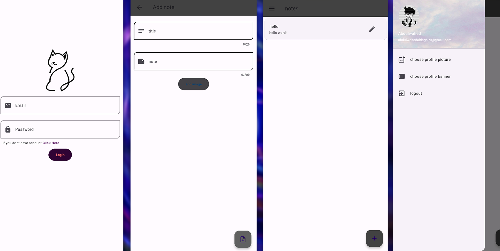

# Notes App

The **Notes App** is a simple and intuitive mobile application designed to help users create, manage, and organize their notes efficiently. Built using **Flutter** for the frontend and powered by **Firebase** for backend services, this app provides a seamless experience for users to store and access their notes anytime, anywhere.

---

## A Message from the Developer 🚀  
This project holds a special place in my journey as a mobile app developer. It was one of my **first-ever projects** when I was a beginner exploring Flutter and Firebase. While it showcases my initial understanding of app development, I encourage you to also check out my latest projects to see how much I've grown and refined my skills. You can find my recent work in [my github](https://github.com/abdulwahed-s). 

---

## Features
- **Create, Edit, and Delete Notes**: Easily add, modify, or remove notes as needed.
- **Firebase Integration**: Securely store and sync your notes using Firebase's real-time database.
- **User-Friendly Interface**: A clean and responsive design for a smooth user experience.
- **Cross-Platform**: Built with Flutter, ensuring compatibility with both Android and iOS devices.

## Download and Try It Out
You can download the APK file and try the app on your Android device by clicking [here](https://github.com/abdulwahed-s/flutter-firebase-notes/releases/download/1.00/notx.apk).

## App Screenshots
Here are some screenshots of the app in action:

---

## Technologies Used
- **Frontend**: Flutter
- **Backend**: Firebase (Authentication, Firestore Database)
- **Deployment**: APK file for Android

---

## How to Use
1. **Download the APK**: Click the link above to download the APK file.
2. **Install the App**: Open the downloaded APK file on your Android device and follow the installation instructions.
3. **Start Taking Notes**: Open the app, create an account, and start managing your notes!

---

## Contribution
Contributions are welcome! If you'd like to contribute to this project, feel free to fork the repository, make your changes, and submit a pull request. Please ensure your code follows the project's coding standards and includes appropriate documentation.

---

## License
This project is open-source and available under the [MIT License](LICENSE). Feel free to use, modify, and distribute it as per the license terms.
